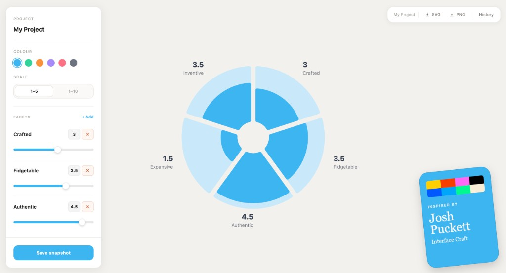

# Facets of Quality - Graph Builder

A small visual tool for turning qualitative product/design facets into editable radial charts.

## Demo

Live app: `https://facets-of-quality-graph-builder.vercel.app/`



## What It Does

- Create, rename, and score custom quality facets
- Use a 1-5 or 1-10 scoring scale
- Save named snapshots and restore previous states
- Switch color themes
- Export charts as SVG and PNG
- Store project data locally in your browser (`localStorage`)

## Tech Stack

- React
- TypeScript
- Vite
- Tailwind CSS
- d3-shape

## Getting Started

```bash
npm install
npm run dev
```

Build production output:

```bash
npm run build
```

Preview production build:

```bash
npm run preview
```

Lint:

```bash
npm run lint
```

## Open Source + Reuse

This project is intentionally MIT licensed so people can:

- copy it
- fork it
- remix it
- use parts of it in their own projects

If you build on top of it, awesome.

## Maintenance Status

This is a fun side project, not a fully maintained product.

- No guaranteed roadmap
- No guaranteed support SLAs
- Community forks and small PRs are welcome

## Contributing

Contributions are welcome, especially small focused improvements.

See `CONTRIBUTING.md`.

## License

MIT - see `LICENSE`.

## Sharing Checklist

See `OPEN_SOURCE.md` for a quick public-repo checklist (secrets, repo metadata, polish items).
